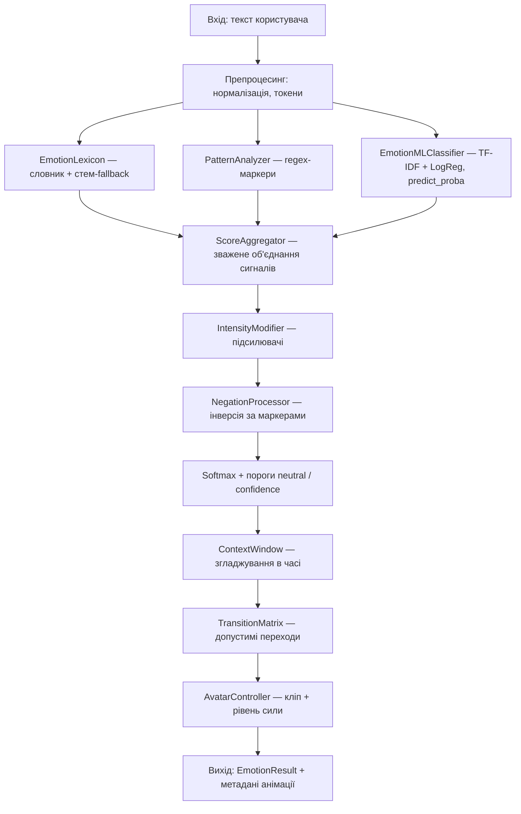

# `assistant_core`: емоційний пайплайн і як з ним працювати

---

## 1. Схема пайплайну (для доповіді)



---

## 2. Команди

**`pytest assistant_core/tests/ -v`** — автоматичні тести емоційного коду.

```bash
pytest assistant_core/tests/ -v
```

**`python -m assistant_core.scripts.train_emotion_model`** — навчання ML-моделі й запис `assistant_core/models/emotion_model.joblib`.

```bash
python -m assistant_core.scripts.train_emotion_model
```

**`python assistant_core/scripts/train_emotion_model.py`** — те саме навчання, запуск файлу скрипта.

```bash
python assistant_core/scripts/train_emotion_model.py
```

**`python -m assistant_core.scripts.train_emotion_model --help`** — опис ключів (test_size, seed, output тощо).

```bash
python -m assistant_core.scripts.train_emotion_model --help
```

**`python -m assistant_core.scripts.train_emotion_model --test-size 0.25 --seed 42`** — приклад навчання з іншими параметрами спліту.

```bash
python -m assistant_core.scripts.train_emotion_model --test-size 0.25 --seed 42
```

**`python -c "… analyze_emotion(…) …"`** — один текст через повний пайплайн без HTTP.

```bash
python -c "from assistant_core.emotion_engine import analyze_emotion; r = analyze_emotion('Я провалив екзамен, дуже сумно'); print(r.emotion, r.confidence, r.method)"
```

**`uvicorn backend.main:app …`** — бекенд (демо емоцій, чат); чат очікує `TOGETHER_API_KEY` у `.env`.

```bash
python -m uvicorn backend.main:app --reload --port 6060
```

**URL після старту сервера** — демо: `http://localhost:6060/emotion-demo`, чат: `http://localhost:6060/chat`.

**`curl … /api/emotion/analyze`** — запит до API, коли сервер уже слухає порт.

```bash
curl -s -X POST http://localhost:6060/api/emotion/analyze \
  -H "Content-Type: application/json" \
  -d '{"text": "Я провалив екзамен, дуже сумно", "reset_context": true}'
```
